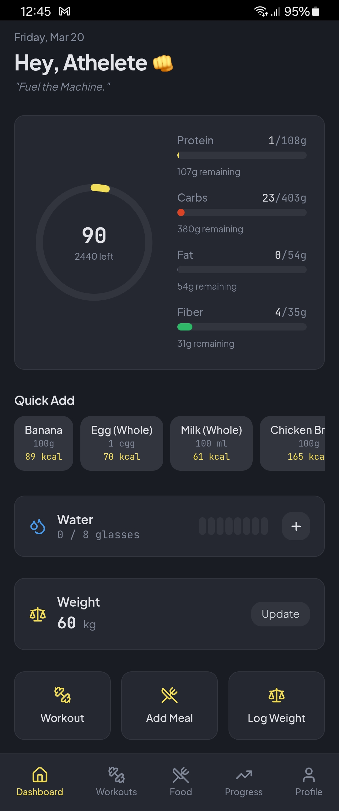
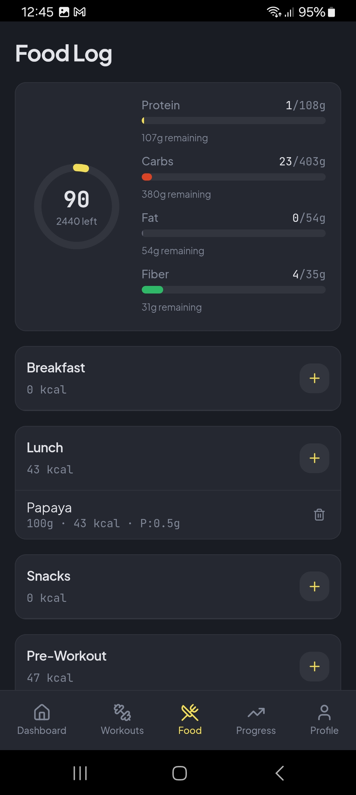
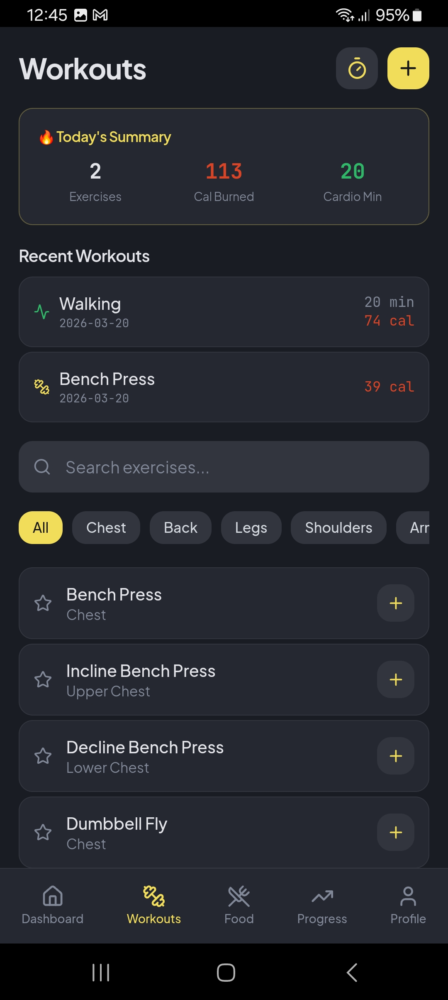
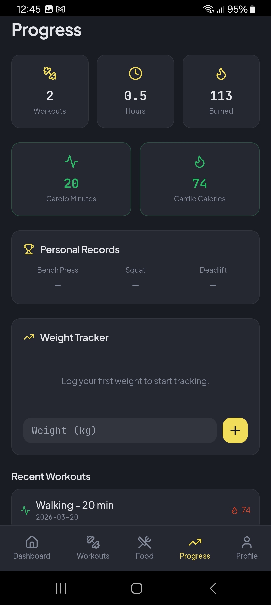
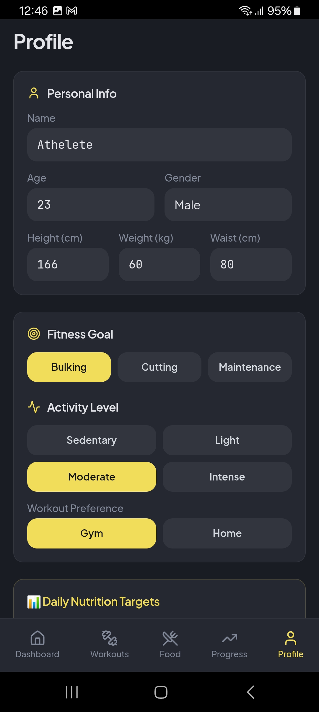
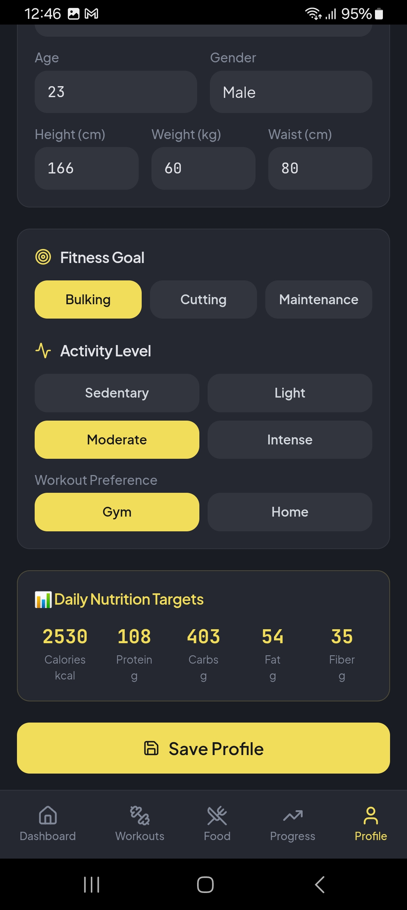

## 🌐 Live Demo

👉 https://fitbycal.vercel.app/

# 💪 FitByCal

A smart fitness and nutrition tracking app that helps you achieve your goals through precise calorie and macro management.

> ⚡ This project is built with ~80% AI assistance.

---

## 🚀 Overview

FitByCal is built on a simple principle:

**Fitness comes from consuming the right amount of calories and nutrients.**

Track your daily intake and align it with your goals:

- Bulking  
- Cutting  
- Maintenance  

---

## 📸 Screenshots

Take a glimpse at FitByCal’s intuitive interface, built to simplify calorie tracking, workout management, and progress monitoring while helping users stay consistent with their fitness journey.

## ✨ Features

- 🔥 Daily calorie calculation  
- 🍗 Macro tracking (Protein, Carbs, Fats, Fiber)  
- 🎯 Goal-based nutrition planning (bulking, cutting, maintenance)  
- 🍎 Food tracking with 50–100+ common foods  
- 🏋️ Includes 50+ workouts with descriptions, guiding users to perform each exercise correctly  
- 🏃 Cardio tracking with time-based inputs (minutes instead of reps)  
- 📊 Progress monitoring  